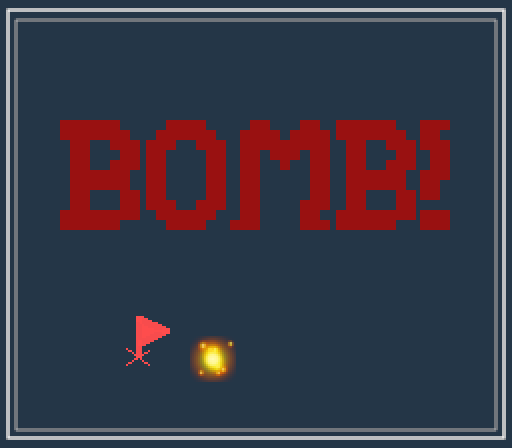

# Mine-Echoer

Author: Yifei Li

Design: Use echoes to detect where the bomb is, and set a flag on it. The higher the pitch of echo sounds, the closer the bomb is.

Screen Shot:

How To Play:

Left-click on the board to echo. The higher the pitch of echo sounds, the closer the bomb is. Right-click to set a flag to indicate the bomb. Press ENTER to check whether you find the bomb. Press ESC to restart when game over.

You can only put one flag at the same time. So to remove a flag, right-click it again.

Sources:

Art sources are drawn by myself. Font source is the base-code source. Clonk sound (setting up flag) is the base-code source. Click sounds are based on the base-code source, and the pitch is generated by myself.

Note:

There is an ugly `clicks.cpp` file because the default `Load` accepts lambda function with no argument. So to pass arguments to it in order to decide pitch, I had to duplicated the same function for hundreds of times. Perhaps there is a better way, but at least it works.

This game was built with [NEST](NEST.md).
